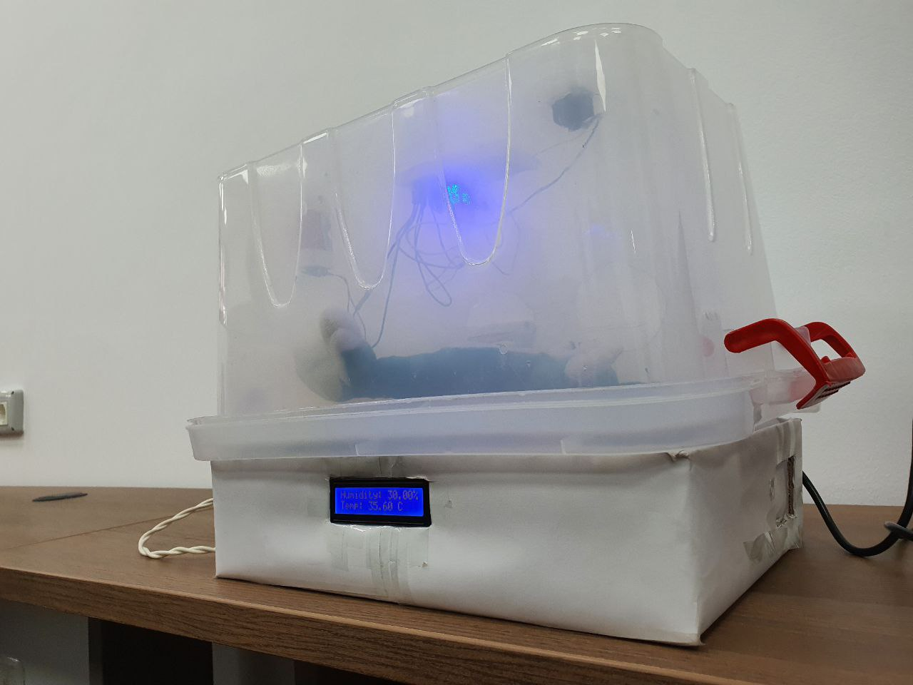

# Baby Incubator

## Table of Contents

1. [Description](#description)
1. [Components Used](#components-used)
1. [Prototype](#prototype)

### Description
Baby Incubator made with Arduino-UNO and Arduino C, Incubators are a fixture in NICUs. They are used in combination with other equipment and procedures to ensure that babies needing extra support have the best possible environment and continual monitoring.

It may help to think of them as a second womb designed to protect a baby and provide the optimal conditions for their development.

### Components Used
- Arduino UNO Board
    > The Mircocontroller of the system 
- Breadboard
    > Fix the components on it
- 2 x DC 9V Fans
    > used to circulate the air inside the incubator chamber and apply positive pressure inside
    it 
- LCD
    > display information for teh incubator like temperature, air quality, humitidy
- Carton Box (Control Unit)
- Plastic Box (Incubator Body)
- 2 x 9V DC Batteries
    > power supply for the system and the leds
- Heat Lamp
    > act as the source of heat to the incubator chamber
- Temperature Sensor
- Air Quality Sensor
- Humidity Sensor
- Ultrasound Sensor
    > used to measure the distance between the surface of the incubator and the door so it determins wheather the door is closed or not
- Buzzer
    > used to make any warning like door is opened or temperature is not set well, air quality is bad or any other warning  
- Relay
    > to control the lamp as it has its value from the 220V AC Supply
- Plug
    > used with the lamp
- Potentiometer
- Resistors
- Jumper Wires
- 10 x Blue LEDs
    > Generating Blue light for the baby to cure jaundice

### Prototype

- Front Side

- Rear Side
.jpeg)

- LCD Displaying Info
.jpeg)

- Inside Circuitary
.jpeg)

- Connected to Laptop
.jpeg)
