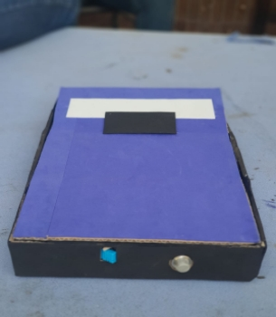
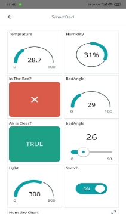
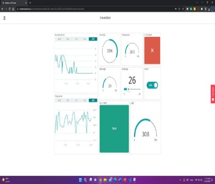

# Telemedicine Smart Bed

**Faculty of Engineering** -
**Systems & Biomedical Engineering Department** 

Table of Contents:

1. [Real-life Problem](#real-life-problem)
2. [Solution idea with assumptions](#solution-idea-with-assumptions)
3. [Web/Mobile Application](#webmobile-application)
4. [Used Components](#used-components)
5. [Electronic Circuit](#electronic-circuit-schematic)
6. [Prototype Snapshots](#prototype-snapshot)
7. [Mobile & Web Dashboards](#mobile-and-web-application)

### Real-Life Problem:

Long waiting lists, limited beds in hospitals, restricted number of doctors and other problems in our healthcare systems
which lead to limited number of patients that can reach proper care from doctors and nurses. Especially, long-term diseases’
patients occupy beds for longer duration while we can provide a system to help patients be followed up by doctors from home.

### Solution idea with assumptions:

A system that uses sensors (**Flex** Sensor, **Light** Sensor, **Temperature** Sensor, **Air Quality** Sensor and **Piezo**
Sensor) to extract patients’ data and some vital signals from home. Then, these data are sent to doctor by our web application
connecting patients with doctors, as the doctor can send his notes and instructions by the app with no need for sending 
the patient physically to doctor. Choice of used sensors for the application depends on the requested case that would be
monitored. A diabetic patient will need *glucose level monitoring* with other basic vital signs as pressure. A patient 
who has done a surgery, and need monitoring for temperature, to check any signs of infections, air quality and humidity 
check for its suitability for the patients, can alarm if any one tried to smoke in patient home room. LDR sensor for 
ensuring suitable lightening in patient room. Flex sensor and servo motor to maintain suitable position of the bed 
depending on location wound and how it would be affecting the patient. Also, for some cases that did orthoepic surgery 
or need physical therapy, flex sensor will be suitable choice in these cases. For all cases, piezoelectric sensor is 
essential to detect if patient is using the bed at a time so the readings cannot be disturbed by his disappearance for 
any reason. In our prototype, we will consider second patient who did recent surgery and need some monitoring.

### Web/Mobile Application:

Each doctor/nurse will be able to access multiple patients in the same time with his account on the application and can
view the dashboard for all readings of each patient individually. We applied dashboard to work both for mobile app and 
website app. So, the doctor/nurse has both options to monitor patients.
As using a mobile application only is not a sufficient way considering that mobile is out of charge suddenly and doctor
need to display patient data immediately. Using only Web app also wouldn't be the best as it's easier for doctor to use
his phone to check up any patient.

### Used Components:

1. **ESP32 board** 
   - integrated solution for wi-fi and Bluetooth IOT apps
2. **Resistors** 
   - Adjusting flex and LDR sensors
3. **Flex sensor** 
   - Detecting the angle of the bed 
4. **DHT11**
   - Measuring temperature and humidity for patient room
5. **Air quality sensor (mq135)**
   - Detecting any air pollutants around patient
6. **LDR|Light intensity**
   - in patient room and how suitable it is 
7. **Piezoelectric** 
   - Checking if patient is using the bed t a time
8. **Servo motor**
   - Movement of the bed and setting its angle
9. **Jumpers**
   - Electronic circuit connections
10. **Bread board**
11. **6V battery holder**
    - Power source for sensors
12. **Cardboard**
    1. Prototype for bed design 
13. **Glue**
    - Prototype
14. **Foam paper**
    - Prototype design

### Electronic Circuit Schematic:

### Prototype Snapshot:

### Mobile and Web Application:

